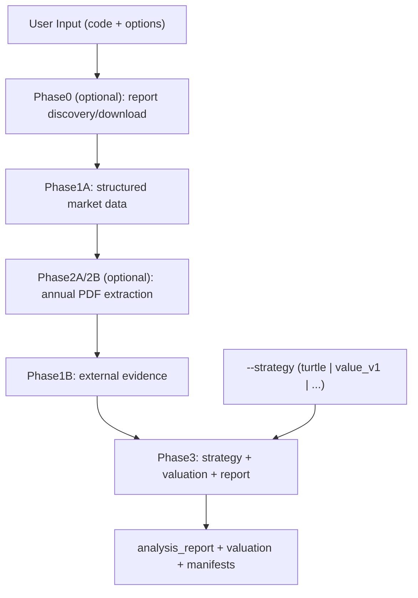

# CLAUDE.md

This file provides guidance to Claude Code (claude.ai/code) when working with code in this repository.

## Project Overview

`trade-signal-schema-kit` is a TypeScript analysis framework for A-share and Hong Kong stock research. It provides data collection → qualitative analysis → quantitative evaluation → valuation → report output capabilities.

## Core Capability Overview

| Goal | Claude slash | Root command | Key outputs |
|------|--------------|--------------|-------------|
| Full workflow (strict branch) | `/workflow-analysis` | `pnpm run workflow:run -- --mode turtle-strict ...` | `analysis_report.md/html`, `valuation_computed.json`, `workflow_manifest.json` |
| Business analysis (PDF-first) | `/business-analysis` | `pnpm run business-analysis:run -- ...` | `qualitative_report.md`, `qualitative_d1_d6.md`, `business_analysis_manifest.json` |
| Valuation only | `/valuation` | `pnpm run valuation:run -- ...` | `valuation_computed.json`, `valuation_summary.md` |
| Download annual report | `/download-annual-report` | `pnpm run phase0:download -- ...` | local PDF |
| Markdown to HTML | `/report-to-html` | `pnpm run report-to-html:run -- ...` | `.html` |

## Architecture (UML)



Execution order for `workflow:run`: Phase 0 (optional) → Phase 1A → (if annual PDF available) Phase 2A/2B → Phase 1B → Phase 3.

## Three Quick Starts (Claude Code)

```text
/workflow-analysis 600887
/business-analysis 600887
/valuation 600887
```

- Use `/workflow-analysis` for end-to-end output.
- Use `/business-analysis` for PDF-first qualitative deliverables (no full Phase3).
- Use `/valuation` when inputs/manifest are already prepared.

## Strategy Switching

- Slash: `/workflow-analysis 600887 --strategy value_v1`
- CLI: `pnpm run workflow:run -- --code 600887 --mode turtle-strict --strategy value_v1`
- Keep entrypoint neutral: strategy is a parameter (`--strategy`), not an entry name.

## Common Commands

```bash
# Install dependencies
pnpm install

# Type check all packages
pnpm run typecheck

# Build all packages
pnpm run build

# Linkage smoke (after build) + quality gates
pnpm run test:linkage
pnpm run quality:all

# Work on specific package
pnpm --filter @trade-signal/schema-core run typecheck
pnpm --filter @trade-signal/provider-http run build

# research-strategies：根目录仍提供 workflow:run 等聚合命令；包内直跑请用 run:*（例：pnpm --filter @trade-signal/research-strategies run run:workflow）
# 产物目录 output v2：默认 `output/workflow/<code>/<runId>/`；`workflow:run` 可选 `--run-id` 固定子目录名（续跑以 checkpoint 为准）；business-analysis 默认 `output/business-analysis/<code>/<runId>/`（PDF 自动发现/下载与 workflow 共用 ensure-annual-pdf）；续跑必须 `--output-dir` 指向 run 根目录。详见 docs/guides/workflows.md
```

## Package Structure

| Package | Purpose |
|---------|---------|
| `schema-core` | Standard fields & MarketDataProvider contracts |
| `provider-http` | HTTP data adapter |
| `provider-mcp` | MCP data adapter |
| `research-strategies` | Strategy & research workflow orchestration |
| `reporting` | MD + HTML report output |

## Notes

- Skills: `.claude/skills/business-analysis/SKILL.md`, `workflow-strict/SKILL.md`, `quality-gates/SKILL.md`.
- `workflow:run --mode standard` keeps legacy behavior (Phase3 may run without `data_pack_report.md`).
- Quality: `pnpm run quality:all` runs regression + golden for **cn_a** and **hk** (`output/phase3_golden/<suite>/`). HK suite is snapshot regression; full HK depth is not yet at A-share parity.

## Documentation

- **Index**: `docs/README.md`（`architecture` / `guides` / `strategy`）
- **Workflows & CLI (Stage)**: `docs/guides/workflows.md`

## Environment Requirements

- Node.js >= 20
- pnpm >= 10