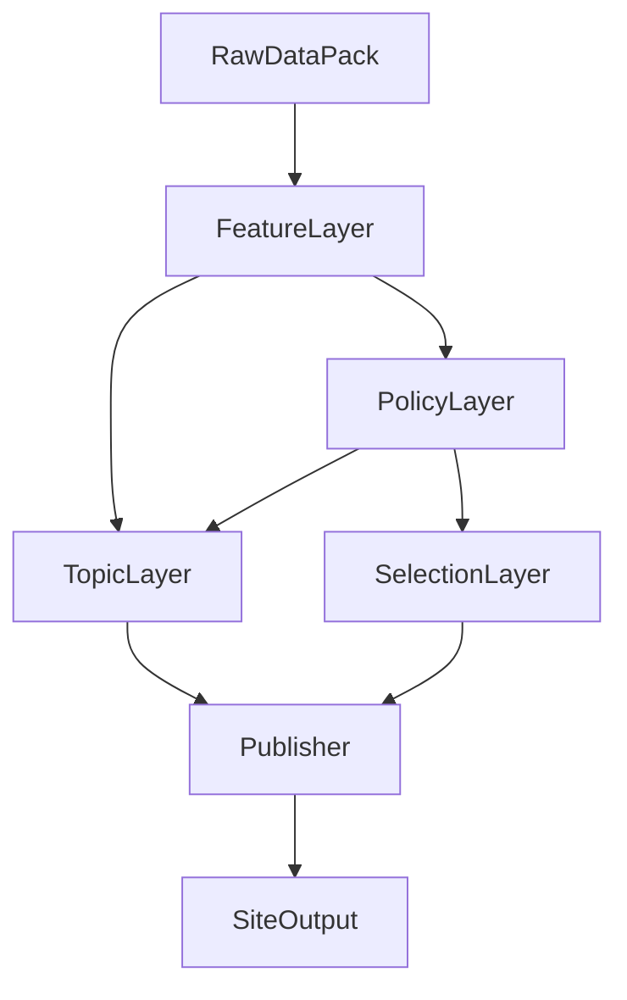

# 架构 V2：流程拓扑（唯一主图）

[返回文档索引](../README.md) · [领域契约](./v2-domain-contract.md) · [插件模型](./v2-plugin-model.md)

## 主流程（四层 + 发布）

### 读图约定

- **FeatureLayer**：按需计算特征；输入来自 RawDataPack。
- **PolicyLayer**：可挂载多个策略插件（如 `policy:turtle`、`policy:value_v1`）；单标的输出 **PolicyResult**。
- **TopicLayer**：渲染 **TopicReport**；六维商业专题为 `topic:business-six-dimension`；龟龟策略**解读页**为 `topic:turtle-strategy-explainer`（消费同一 `PolicyResult`）。
- **SelectionLayer**：基于多标的 PolicyResult 做候选池与排序；**不是** Topic 的子分支。
- **Publisher**：读取专题清单与 TopicReport，写入研报站结构（manifest 驱动）。

## 双通道（个股 vs 选股）

| 通道 | 起点 | 终点 |
|------|------|------|
| **Reporting** | Feature + Policy → Topic → Publisher | 站点专题页 |
| **Selection** | Policy（多标的）→ Selection →（可选）候选 Topic 下钻 → Publisher | 候选列表 / 组合看板 / 下钻专题 |

## 与旧 Phase 的映射（便于迁移对话）

| V2 层 | 当前实现（粗映射） |
|--------|---------------------|
| RawDataPack | Phase1A/1B/2B 产物、市场包、年报包等 |
| FeatureLayer | 由 Phase3 因子与估值中间量逐步抽离 |
| PolicyLayer | `StrategyPlugin` / Phase3 规则决策等 |
| TopicLayer | `report-polish` 多页 Markdown 等 |
| SelectionLayer | `screener`、未来多策略池 |
| Publisher | `reports-site:emit` / sync |

精确迁移顺序见仓库 Phase C 任务清单。

## 全流程完成口径（对外）

- **发布完成**：`publish_ready=true`，且站点可访问计划内 Topic。
- **含六维的商业专题**：发布集合中包含 `topic:business-six-dimension`。

## 相关文档

- [v2-domain-contract.md](./v2-domain-contract.md)
- [v2-plugin-model.md](./v2-plugin-model.md)
- [workflows.md](../guides/workflows.md)
